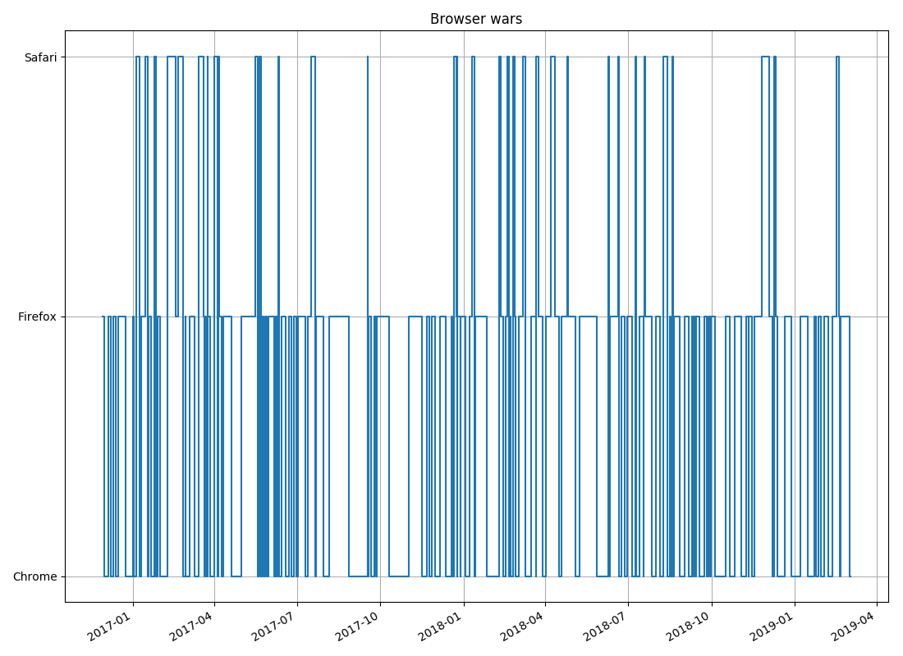
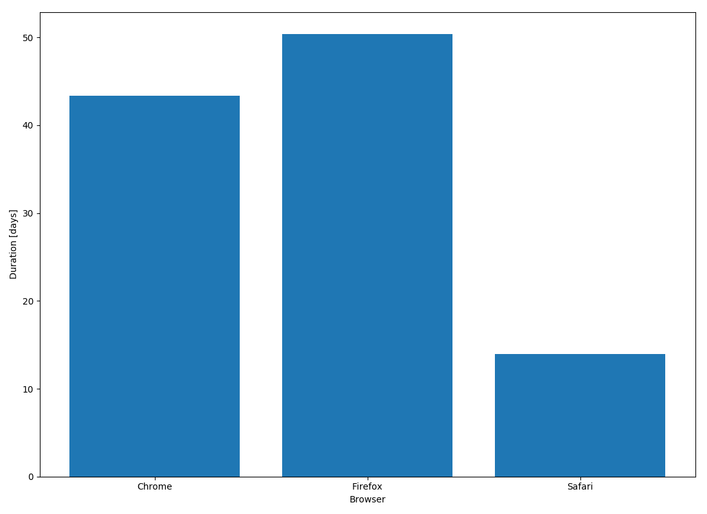

# Browser wars

Recently I've been changing browsers basically every day. At least it feels like that.

I've started tracking when I change browsers through my [dotfiles][1] git history.

Code is kept in [`analysis.py`][2] and the results are shown below:

## Running

To run the analysis, install the [requirements](#requirements), and run `make`.
It is assumed that the dotfiles dir is in `${HOME}/dotfiles`. If this is not
the case, run `make DOTFILES=<path>`.

## Requirements

* Python 3.6
* `matplotlib`

[1]: https://github.com/mindriot101/dotfiles
[2]: https://github.com/mindriot101/browser-wars/blob/master/analysis.py
